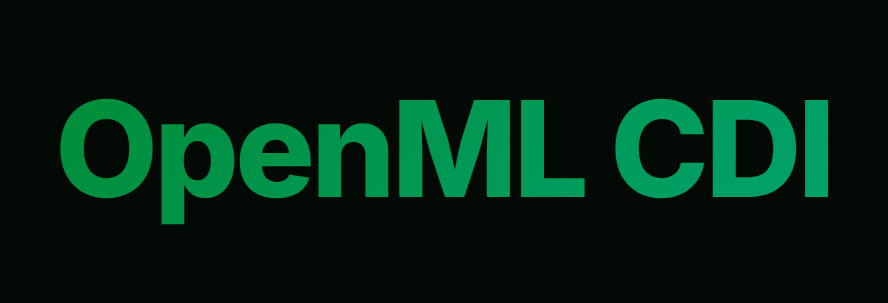

# OpenML Upload

<p align="center">
  
</p>

[](https://github.com/ludev-nl/2026-40-OpenML_Uploading_Interface/actions/workflows/docker-publish.yaml)
[](https://github.com/ludev-nl/2026-40-OpenML_Uploading_Interface/actions/workflows/tests.yaml)

OpenML Upload is a web application for uploading, scanning, reviewing, and
managing OpenML datasets. The application uses a FastAPI backend, a React
frontend, PostgreSQL for the production Compose stack, ClamAV, Caddy, and local
or S3-compatible object storage.

## Table of Contents

- [Project Structure](#project-structure)
- [Local Development](#local-development)
- [Docker Development Stack](#docker-development-stack)
- [Configuration](#configuration)
- [Storage and Scanning](#storage-and-scanning)
- [Testing and Automation](#testing-and-automation)
- [Production Deployment](#production-deployment)
- [Contributing](#contributing)
- [Security](#security)
- [Credits and Third-Party Libraries](#credits-and-third-party-libraries)

## Project Structure

```text
backend/   FastAPI app, Alembic migrations, backend tests, Python tooling
frontend/  React app, frontend tests, Vite and TypeScript tooling
e2e/       Playwright end-to-end tests
docs/      Developer, testing, deployment, and architecture documentation
infra/     Local infrastructure config such as Caddy and MinIO policy files
```

The backend Python package is named `app`, but backend commands should run from
the `backend/` directory unless a command below says otherwise.

## Local Development

Minimum prerequisites for the direct local path:

- Python 3.12 or newer
- Node.js 22.12 or newer
- pnpm

Start the backend:

```bash
python -m venv .venv
source .venv/bin/activate
pip install -r backend/requirements.txt
cp backend/app/.env.example backend/.env
cd backend
alembic upgrade head
uvicorn app.main:app --reload
```

The backend runs at `http://localhost:8000`. The copied `backend/.env` uses
SQLite and local filesystem storage by default. To use the UI without setting up
real GitHub OAuth, set these values in `backend/.env` before starting the
backend:

```env
AUTH_DEV_MODE_APPROVE_ALL_LOGINS=true
COOKIE_SECURE=false
```

Start the frontend in a second terminal:

```bash
cd frontend
pnpm install
pnpm run dev
```

The frontend runs at `http://localhost:5173` and calls the backend at
same-origin `/api` by default. For split local development, set
`VITE_API_BASE_URL=http://localhost:8000/api` in `frontend/.env`.

## Docker Development Stack

Use Docker when you need the full local upload stack: backend, frontend, MinIO,
ClamAV, migrations, and service networking. This development stack still uses
SQLite unless you provide `DATABASE_URI`.

```bash
docker compose -f docker-compose.dev.yml up --build
```

Local services:

- Frontend: `http://localhost:5173`
- Backend API: `http://localhost:8000`
- MinIO API: `http://localhost:9000`
- MinIO Console: `http://localhost:9001`

For production-style Docker Compose with PostgreSQL and Caddy, see
[Docker hosting](docs/how-to/docker-hosting.md).

## Configuration

Use these example files as starting points:

- `.env.example` for the root production-style Compose stack
- `backend/app/.env.example` for running the backend directly from `backend/`
- `frontend/.env.example` for frontend-only environment variables

Common backend settings:

- `DATABASE_URI` controls the direct backend database connection.
- `JWT_SECRET` signs authentication tokens.
- `COOKIE_SECURE=false` is for local HTTP; use `true` behind HTTPS.
- `AUTH_DEV_MODE_APPROVE_ALL_LOGINS=true` bypasses real GitHub OAuth for local
  development only.
- `STORAGE_BACKEND=local` uses filesystem storage.
- `STORAGE_BACKEND=s3` enables S3-compatible storage such as MinIO or AWS S3.

GitHub OAuth and GitHub App issue integration are optional for basic local
development. Configure them when you need real login or dataset review issues.

## Storage and Scanning

The direct local backend defaults to local filesystem storage. The Docker
development stack uses MinIO with these values:

```env
STORAGE_BACKEND=s3
S3_BUCKET=openml-upload-local
S3_REGION=eu-west-1
S3_ENDPOINT=http://minio:9000
S3_PUBLIC_ENDPOINT=http://localhost:9000
S3_ACCESS_KEY=minioadmin
S3_SECRET_KEY=minioadmin123
S3_FORCE_PATH_STYLE=true
```

For AWS S3, leave `S3_ENDPOINT` empty and set `S3_FORCE_PATH_STYLE=false`.

Dataset upload confirmation requires a reachable ClamAV `clamd` daemon. If
ClamAV is unavailable, uploaded files remain quarantined and are not promoted
for download. For details, see
[Local S3-Compatible Storage](docs/how-to/local-s3-storage.md) and the
[S3 storage reference](docs/reference/s3-storage.md).

## Testing and Automation

Quick checks:

```bash
(cd backend && python -m pytest)
(cd frontend && pnpm run test:coverage)
```

Full local automation needs the frontend dependencies, root Playwright
dependencies, Pyright, and Lefthook:

```bash
pnpm --dir frontend install
npm ci
pnpm add -g pyright
pipx install lefthook
lefthook install
lefthook run pre-commit --all-files
```

End-to-end tests require the local stack to be running. See
[e2e/README.md](e2e/README.md).

## Production Deployment

The documented production-like path today is Docker Compose; see
[Docker hosting](docs/how-to/docker-hosting.md). A production deployment should
provide HTTPS, PostgreSQL backups, S3-compatible object storage, ClamAV scanning,
secure secret storage, and `COOKIE_SECURE=true`.

AWS deployment is planned as separate work. Once it is implemented and verified,
add a dedicated AWS deployment guide under `docs/how-to/` and link it here.

## Contributing

Please follow [CONTRIBUTING.md](CONTRIBUTING.md). The contribution guide covers
branch naming, issue workflow, commit message format, testing expectations, and
pull request process.

For more project documentation, see the [documentation index](docs/index.md).

## Security

Do not commit plaintext secrets. Use local `.env` files for personal
development, SOPS for encrypted team secrets, and a managed secret store for
production deployments.

If you find a security issue, do not open a public issue with exploit details.
Contact the maintainers privately first.

## Credits and Third-Party Libraries

This project builds on open-source libraries and tools across the backend,
frontend, and infrastructure stack. See
[docs/references/credits.md](docs/references/credits.md) for the full list with
descriptions and links.
