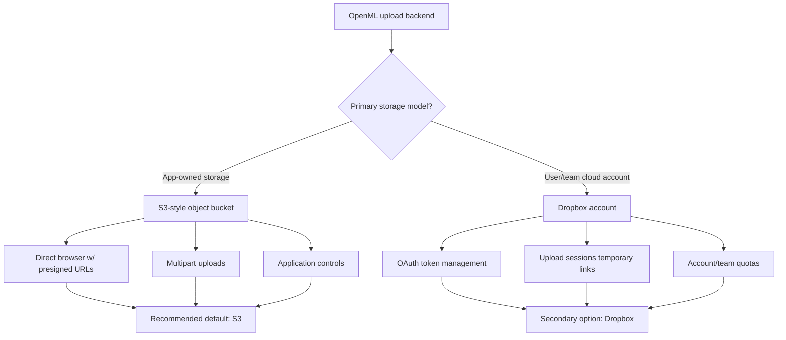
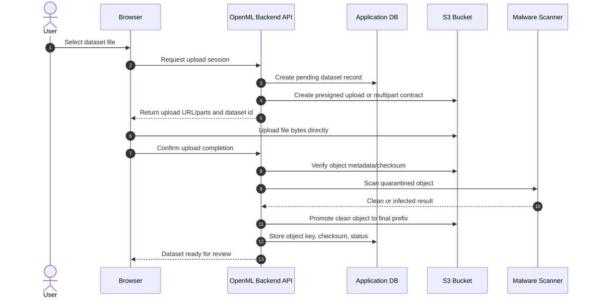
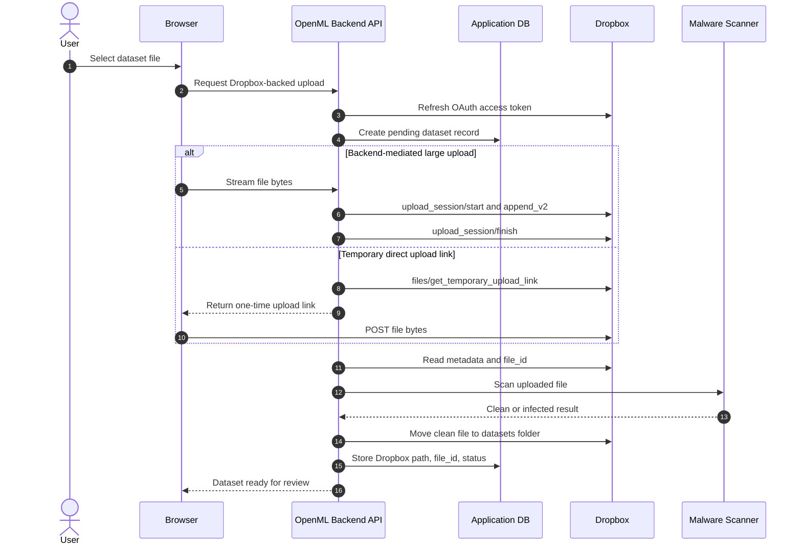

# Dropbox and S3 viability for the OpenML upload backend

## Short summary

Dropbox is technically viable for the OpenML upload flow, but it is not the best default for primary app-owned storage. Its public HTTP API and official SDKs support upload, download, listing, metadata, deletion, sharing links, and large-file upload sessions. The main mismatch is architectural: Dropbox is organized around user- or team-owned namespaces, while this upload backend needs application-owned storage with malware scanning, review state, and controlled downloads.

S3 is the stronger default backend. It is designed for app-owned buckets, direct browser uploads through presigned requests, multipart uploads for large files, etc. Dropbox should remain a feasible secondary option, nothing but that

Decision diagram

## Provider comparison

| Topic                 | Dropbox                                                                                                                                                       | S3                                                                                                         |
| --------------------- | ------------------------------------------------------------------------------------------------------------------------------------------------------------- | ---------------------------------------------------------------------------------------------------------- |
| Primary fit           | User- or team-scoped cloud storage. Can work with a dedicated app-owned account, but this is not the cleanest conceptual model.                               | App-owned object storage. Natural fit for backend-controlled upload, scan, review, and download workflows. |
| Authentication        | OAuth 2.0, scoped apps, short-lived access tokens, optional refresh tokens, and PKCE for public clients.                                                      | Backend IAM credentials. Browser receives only time-limited presigned upload or download permissions.      |
| Large uploads         | Upload sessions through`upload_session/start`, `upload_session/append_v2`, and `upload_session/finish`. SDK guidance avoids single upload calls above 150 MB. | Multipart upload with individually signed requests. Better match for large datasets.                       |
| Direct browser upload | `files/get_temporary_upload_link` can create one-time upload links, but this is narrower than S3 presigned upload support.                                    | Presigned PUT, browser POST policies, and multipart upload are standard patterns.                          |
| Operational risk      | Token revocation, namespace locks, unpublished exact rate limits, and Dropbox account/team semantics.                                                         | IAM policy design, lifecycle cleanup, multipart-abort handling, and bucket security.                       |

## Dropbox viability

Dropbox exposes a public HTTP API suitable for server-side integration and some browser-facing flows. The API supports the operations this backend needs:

- Upload: `files/upload` for small files, plus `files/upload_session/start`, `files/upload_session/append_v2`, and `files/upload_session/finish` for larger files.
- Download: `files/download` and `files/get_temporary_link`.
- Listing and metadata: `files/list_folder`, `files/list_folder/continue`, and `files/get_metadata`.
- Delete: `files/delete_v2`.
- Sharing links: `sharing/create_shared_link_with_settings`, if a shared-link publishing model is needed later.
- Change detection: list-folder cursors and webhooks.

The most practical Dropbox model for this application would be an app-owned integration against a dedicated Dropbox account or team namespace. The backend would store the Dropbox refresh token securely, mint short-lived access tokens server-side, place uploaded files into a quarantine folder, scan them, move clean files into a datasets folder, and store the Dropbox path plus provider file ID in the application database.

The user-owned Dropbox model is less attractive. It would require one refresh token per uploader, account relinking when tokens are revoked, user quota handling, and a separate access model for reviewers who need to inspect files spread across many users' Dropbox accounts.

## Authentication model

Dropbox uses OAuth 2.0 with scoped apps, short-lived access tokens, optional refresh tokens for offline access, and PKCE support for public clients such as SPAs and mobile apps. New apps start in a development state, and public release can require Dropbox production review.

Likely Dropbox scopes for this workflow:

- `account_info.read` for account identity.
- `files.metadata.read` for folder listing and metadata.
- `files.content.read` for downloads and temporary download links.
- `files.content.write` for uploads, moves, and deletes.
- `sharing.write` only if Dropbox shared links become part of the product design.

The main security concern is refresh-token storage. In an app-owned Dropbox design, the backend stores one or a small number of refresh tokens. In a user-owned Dropbox design, the backend stores a refresh token per uploader, which increases credential-management and account-recovery overhead.

S3 is simpler for this app. The backend authenticates with IAM credentials and creates presigned URLs so the browser can upload without receiving AWS credentials. Those presigned requests inherit the backend principal's permissions and can be time-limited.

## Official SDKs

Dropbox publishes official SDKs for several languages, including Python and JavaScript. For this project:

- Python SDK: useful for backend integration.
- JavaScript SDK: useful for browser tooling or Node-based integration, including OAuth/PKCE examples.

The source document notes current Dropbox SDK releases for Python and JavaScript, and also notes that AWS SDKs are first-party and actively maintained. For this stack, the likely AWS choices are Boto3 on the backend and AWS SDK for JavaScript v3 if direct JavaScript tooling becomes necessary.

## Limits relevant to ML dataset uploads

- Dropbox SDK guidance says not to use single-call upload above 150 MB.
- Dropbox upload-session requests should also stay below 150 MB per request.
- Dropbox upload sessions can stay open for up to 7 days.
- Dropbox concurrent upload sessions can parallelize append calls when part sizes are multiples of 4 MiB, except the final chunk.
- Dropbox documentation has an important inconsistency: some developer-facing references mention 350 GB for upload sessions/API uploads, while newer Help Center material mentions 2 TB. Use 350 GB as the conservative planning assumption unless Dropbox confirms the higher API limit for this use case.
- Dropbox does not publish exact general API rate limits. It documents HTTP 429 handling with `Retry-After` and warns about too many parallel writes to the same namespace.
- Dropbox paid plans can satisfy the current 1 TB storage target, so capacity is not the primary concern.
- S3 single PUT upload supports up to 5 GB.
- S3 multipart upload supports much larger objects, with up to 10,000 parts.
- S3 general-purpose buckets have no maximum bucket size and no object-count limit.

## Recommended S3 integration outline

For the OpenML upload backend, the preferred proof of concept is S3:

1. Create an app-owned bucket with separate `quarantine/` and `datasets/` prefixes.
2. Add storage-backend methods for multipart initiation, part upload or presign generation, completion, metadata lookup, delete, signed download, and abort.
3. The frontend calls the backend to create a pending dataset row.
4. The backend returns either presigned PUT/POST data or a multipart-upload contract.
5. The browser uploads directly to the quarantine prefix.
6. The backend verifies completion server-side.
7. The malware scanner scans the uploaded object.
8. Clean objects are promoted into the final prefix.
9. The database stores first-class provider metadata such as `storage_backend`, `storage_key`, checksum/content hash, byte size, and upload state.
10. Reviewers download through the OpenML backend or through short-lived presigned GET URLs.

## Possible Dropbox integration outline

A Dropbox proof of concept is possible, but it should be scoped as a secondary provider path:

1. Register a Dropbox app with the smallest required scopes.
2. Complete OAuth for a dedicated Dropbox account or team integration.
3. Store the refresh token server-side.
4. Create a pending dataset row in the application database.
5. Upload either through backend-mediated upload sessions or through `files/get_temporary_upload_link` when resumability is not required.
6. Record the Dropbox path, file ID, content hash if available, byte size, and upload state.
7. Scan the uploaded file before marking it ready for review.
8. Move clean files from quarantine into a datasets folder.
9. Prefer OpenML application download routes over Dropbox shared links for the main review/download workflow.

## Storage abstraction changes

The current storage abstraction will need to grow regardless of provider. The follow-up implementation should consider methods for:

- `delete`
- `exists` or `get_metadata`
- `open_read_stream`
- `initiate_large_upload`
- `append_part` or `create_part_upload_url`
- `complete_upload`
- `abort_upload`
- `create_download_url`
- `promote_from_quarantine`

Provider metadata should also become first-class database data instead of opaque JSON. Useful fields include:

- `storage_backend`
- `storage_key`
- `provider_file_id`, where available
- `checksum` or content hash
- `byte_size`
- `content_type`
- `upload_state`

## Dataset URL consideration

Dropbox gives two imperfect options for dataset URLs:

- `files/get_temporary_link`, which expires after four hours and is not durable enough for metadata publication.
- Shared links, which are share-oriented and may be public by default unless restricted by settings and team policy.

For Dropbox, the safer abstraction is an OpenML authenticated download endpoint. For S3, the product can choose between an app download endpoint, short-lived presigned URLs, or a stable public/CDN URL depending on the publication model.

## Acceptance criteria coverage

- Summary viability statement: Dropbox can support the intended workflow, but S3 is recommended as the first production backend candidate.
- Authentication model: OAuth 2.0 for Dropbox; IAM and presigned requests for S3.
- API surfaces: Dropbox upload, chunked upload, listing, metadata, delete, download, temporary links, and sharing links are listed.
- SDKs: Dropbox Python and JavaScript SDKs are identified; AWS Boto3 and JavaScript SDK v3 are noted for S3.
- Limits: Dropbox upload/session guidance, rate-limit behavior, storage tiers, and S3 object/bucket limits are summarized.

## Sources

- [Dropbox Developers Documentation](https://www.dropbox.com/developers/documentation)
- [Dropbox API Getting Started Guide](https://www.dropbox.com/developers/reference/getting-started)
- [Dropbox API Performance Guide](https://www.dropbox.com/lp/developers/reference/dbx-performance-guide)
- [Dropbox scoped apps and enhanced permissions](https://dropbox.tech/developers/now-available--scoped-apps-and-enhanced-permissions)
- [Dropbox migration guide for app permissions and access tokens](https://dropbox.tech/developers/migrating-app-permissions-and-access-tokens)
- [Dropbox OAuth 2.0 with offline access](https://dropbox.tech/developers/using-oauth-2-0-with-offline-access)
- [Dropbox JavaScript SDK reference](https://dropbox.github.io/dropbox-sdk-js/Dropbox.html)
- [Dropbox Python SDK releases](https://github.com/dropbox/dropbox-sdk-python/releases)
- [Dropbox Standard plan storage documentation](https://help.dropbox.com/plans/standard-plan)
- [Dropbox Webhooks Reference](https://www.dropbox.com/developers/reference/webhooks)
- [AWS S3 presigned upload URL guide](https://docs.aws.amazon.com/AmazonS3/latest/userguide/PresignedUrlUploadObject.html)
- [AWS S3 presigned URL guide](https://docs.aws.amazon.com/AmazonS3/latest/userguide/using-presigned-url.html)
- [AWS S3 PutObject API reference](https://docs.aws.amazon.com/AmazonS3/latest/API/API_PutObject.html)
- [AWS S3 uploading objects guide](https://docs.aws.amazon.com/AmazonS3/latest/userguide/upload-objects.html)
