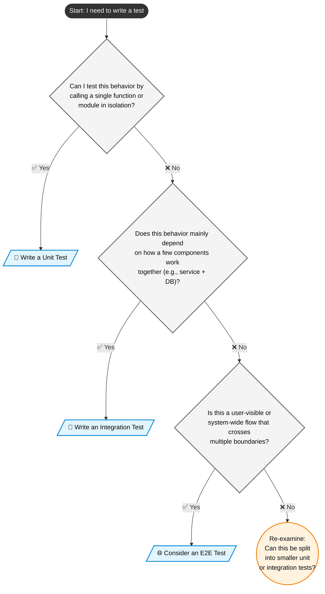

# Testing guide

This guide explains the different kinds of tests in this repository, when to use each, and how they fit together. It links to more detailed how-to guides for each test type.

> [!TIP]
> If you are unsure what to write tests for, start here before opening a PR.

---

## Goals of our testing strategy

Our testing strategy aims to:

- Catch bugs as early as possible (preferably at the unit test level).
- Keep the feedback loop fast for contributors.
- Make tests readable and maintainable, so they evolve with the codebase.
- Give reviewers confidence that changes are safe to merge.

No single test type is sufficient on its own. We rely on a **mix** of unit, integration, and end-to-end (E2E) tests, each with a clear purpose and scope.

---

## Test types

Use this section as a quick reference to decide which type of test you should write.

| Test type   | 🧱 Scope                                 | ⏱️ Speed  | Primary purpose                          |
| ----------- | ---------------------------------------- | --------- | ---------------------------------------- |
| Unit        | A single function/module, isolated       | Very fast | Validate small, focused pieces of logic  |
| Integration | Multiple components working together     | Medium    | Validate interactions and integrations   |
| End-to-end  | Full system from an external entry point | Slow      | Validate real user flows and regressions |

For details on how to write each type of test, see:

- [Unit testing guide](./unit-test.md)
- [Integration testing guide](./integration-test.md)
- [End-to-end testing guide](./e2e-test.md)

---

## When to write which test

### 🧪 Start with unit tests

You should almost always start by writing or updating **unit tests** when:

- 🎯 You add or change business logic.
- You fix a bug that can be reproduced at the function or module level.
- You refactor code without changing externally visible behavior.

Unit tests should answer: **“Does this piece of logic do what we expect in all relevant edge cases?”**

See: [Unit testing guide](./unit-test.md)

---

### 🔗 Add integration tests when behavior crosses boundaries

Write **integration tests** when:

- 🤝 The behavior depends on multiple components working together (e.g., service + database + messaging).
- A bug involves how modules interact, not just an isolated function.
- You introduce or change integration with an external system (database, queue, API, etc.).

Integration tests should answer: **“Do these components behave correctly when combined in realistic conditions?”**

See: [Integration testing guide](./integration-test.md)

---

### 🌐 Use E2E tests for critical flows only

Write **end-to-end tests** when:

- 🧍You need to verify a full user or system flow from the outside (e.g., HTTP API, UI, CLI).
- The risk of regression is high and not easily covered by unit or integration tests.
- The behavior depends heavily on configuration, deployment, or environment.

E2E tests should answer: **“Can a real user (or external system) complete this flow successfully?”**

Because E2E tests are slow and more brittle (i.e. expensive to run), we keep them:

- Focused on **high-value** and **critical** scenarios.
- As simple and stable as possible.

See: [End-to-end testing guide](./e2e-test.md)

---

## 🧱 What belongs in / out of scope for each type

### 🧪 Unit tests – in scope

✅ Unit tests are appropriate for:

- Pure functions or small, well-defined methods.
- Validation logic and edge cases.
- Error handling paths.
- Simple interactions that can be mocked (e.g., a function that calls an injected dependency).

❌ Out of scope for unit tests:

- Real network calls, databases, or file systems.
- Full request/response flows.
- Cross-service workflows.

---

### 🔗 Integration tests – in scope

✅ Integration tests are appropriate for:

- Repository/database access (with a real or realistic DB).
- Services or modules that coordinate multiple dependencies.
- Serialization/deserialization and data transformation across layers.
- Behavior that cannot be meaningfully validated with mocks alone.

❌ Out of scope for integration tests:

- Full UI or API flows from the user’s perspective.
- Exhaustive branch coverage of low-level logic (that belongs to unit tests).

---

### 🌐 E2E tests – in scope

✅ E2E tests are appropriate for:

- Core user journeys (e.g., “user signs up and performs X”).
- Critical business flows that must not break (e.g., payment, authentication).
- Regression coverage for previously broken, high-impact flows.

❌ Out of scope for E2E tests:

- Fine-grained edge cases better handled by unit or integration tests.
- Large test matrices of permutations (those should be covered at lower levels).

---

## 🧭 Choosing the right test type

📌 Use this checklist when deciding what to write:

1. **Can I test this behavior by calling a 🎯 single function or module in isolation?**
   - ✅ Yes → Prefer a 🧪 **unit test**.
   - ❌ No → Go to step 2.

2. **Does this behavior mainly depend on how a few components work 🤝 together (e.g., service + DB)?**
   - ✅ Yes → Prefer an 🔗 **integration test**.
   - ❌ No → Go to step 3.

3. **Is this a user-visible or system-wide flow that crosses multiple 🧱 boundaries and needs a realistic environment?**
   - ✅ Yes → Consider an 🌐 **E2E test**.
   - ❌ No → Re-examine if the behavior can be split into smaller unit or integration tests.

As a rule of thumb, prefer **more unit tests**, a **reasonable number of integration tests**, and a **small, highly curated set of E2E tests**.

---

## Expectations for pull requests

When opening a PR, you are expected to:

- Add or update 🧪 **unit tests** for any changed logic.
- Add 🔗 **integration tests** if your change affects cross-module behavior or integrations.
- Add or update 🌐 **E2E tests** only when you introduce or modify critical end-to-end flows.
- Briefly mention in the PR description:
  - What tests you added or updated.
  - Why you chose unit, integration, or E2E for this change.

Reviewers may request additional tests or a different test type if the chosen level does not match the impact or risk of the change.

---

## Where tests live in this repo

We follow the following structure inside of `app/`(for the backend) and `frontend/` (for the fronted) folders.

- `(app + frontend)/tests/unit/` – Unit tests
- `(app + frontend)/tests/integration/` – Integration tests
- `e2e-tests/` – End-to-end tests

Each guide explains the expected structure and naming conventions for that test type in more detail.

- [Unit testing guide](./unit-test.md)
- [Integration testing guide](./integration-test.md)
- [End-to-end testing guide](./e2e-test.md)

---

## Related documentation

- [Contributing guide](../CONTRIBUTING.md) – general contribution rules, naming conventions, and PR expectations.
- [Unit testing guide](./unit-test.md)
- [Integration testing guide](./integration-test.md)
- [End-to-end testing guide](./e2e-test.md)
