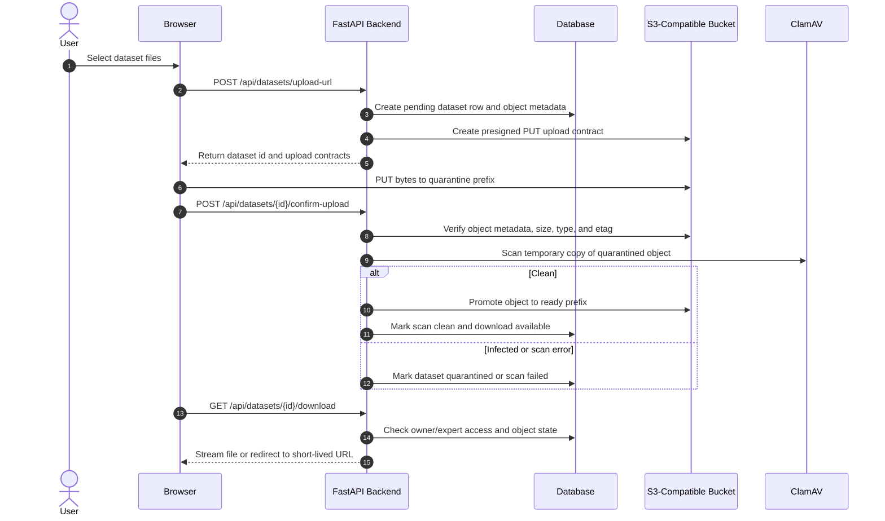

# S3 Storage Architecture and Local Setup

This document is the source of truth for the S3-compatible storage path used by the OpenML Upload application. It replaces the earlier Dropbox/S3 spike as the final storage decision: production-style deployments should use explicit S3-compatible object storage, while local filesystem storage remains a deliberate development and test option.

## Storage Backends

| Backend | Intended use                                                      | Notes                                                                                                                                                               |
| ------- | ----------------------------------------------------------------- | ------------------------------------------------------------------------------------------------------------------------------------------------------------------- |
| `s3`    | Production and production-like development                        | Stores upload objects in an app-owned S3-compatible bucket. Required for direct browser upload contracts and realistic scan/promotion behavior.                     |
| `local` | Unit tests, simple local development, and fallback-free debugging | Stores files below `LOCAL_UPLOAD_DIR`. Use this only when object-storage behavior is not under test.                                                                |
| `smart` | Legacy compatibility path                                         | Attempts S3 through `smart_open` and falls back to local storage. Do not use it for production readiness checks because it can hide storage configuration failures. |

`STORAGE_BACKEND=s3` intentionally requires `S3_BUCKET`. If the bucket is missing or unreachable, startup or storage operations should fail visibly instead of silently switching to local storage.

## Required Environment Variables

| Variable                     | Required for S3             | Example                     | Description                                                                         |
| ---------------------------- | --------------------------- | --------------------------- | ----------------------------------------------------------------------------------- |
| `STORAGE_BACKEND`            | Yes                         | `s3`                        | Selects the configured storage backend. Use `s3` for S3-compatible storage.         |
| `S3_BUCKET`                  | Yes                         | `openml-datasets`           | Bucket where quarantined and promoted dataset objects are stored.                   |
| `S3_REGION`                  | Recommended                 | `eu-west-1`                 | Region passed to the S3 client. Some local S3-compatible services accept any value. |
| `S3_ENDPOINT`                | Local S3-compatible only    | `http://localhost:9000`     | Custom endpoint for MinIO or another S3-compatible service. Leave empty for AWS S3. |
| `S3_ACCESS_KEY`              | Local or static credentials | `minioadmin`                | Access key used by the backend when static credentials are configured.              |
| `S3_SECRET_KEY`              | Local or static credentials | `minioadmin`                | Secret key used by the backend when static credentials are configured.              |
| `S3_FORCE_PATH_STYLE`        | Usually for MinIO           | `true`                      | Enables path-style bucket addressing required by many local S3-compatible services. |
| `UPLOAD_URL_EXPIRES_SECONDS` | No                          | `3600`                      | Lifetime for presigned upload and download URLs.                                    |
| `QUARANTINE_DIR`             | Yes for scanning            | `.quarantine`               | Local temporary directory used for ClamAV scan copies.                              |
| `CLAMD_SOCKET`               | Optional                    | `/var/run/clamav/clamd.ctl` | Unix socket for ClamAV. Takes precedence over host/port when set.                   |
| `CLAMD_HOST`                 | Yes for TCP ClamAV          | `127.0.0.1`                 | Hostname for the ClamAV daemon.                                                     |
| `CLAMD_PORT`                 | Yes for TCP ClamAV          | `3310`                      | TCP port for the ClamAV daemon.                                                     |
| `CLAMD_TIMEOUT_SECONDS`      | No                          | `10`                        | Timeout for scan requests.                                                          |

`LOCAL_UPLOAD_DIR` is still used by local storage and by current scan/download helper paths. For container deployments, set it to a persisted location such as `/data/uploads`.

## Object Layout

S3 objects use separate prefixes for unsafe and clean data:

| Prefix                                       | Purpose                                                                     |
| -------------------------------------------- | --------------------------------------------------------------------------- |
| `quarantine/{batch_id}/{safe_original_path}` | Initial upload destination. Objects here are not downloadable.              |
| `ready/{dataset_id}/{safe_original_path}`    | Final clean-object location after upload verification and malware scanning. |

The dataset metadata stores object-level state so the application can reason about storage independently from a raw object URL. Each object record should include:

- `backend` and `provider`
- `bucket`
- `object_key`
- `quarantine_key`
- `final_object_key`
- `original_path`
- `content_type`
- `byte_size`
- `checksum`
- `etag`
- `upload_state`
- `scan_state`
- `download_state`

Do not expose permanent raw S3 URLs as dataset download links. The app should use authenticated application routes or short-lived backend-generated URLs.

## Upload, Scan, Promotion, and Download Flow



The direct upload contract is intentionally split from confirmation. A successful browser `PUT` only proves that S3 accepted bytes. The backend still has to verify object metadata, run malware scanning, and update dataset object state before the upload can become downloadable.

## Multipart Upload Contract

Large S3-backed uploads use the same `/api/datasets/upload-url` dataset creation endpoint, but the returned upload contract can ask the frontend to use multipart upload instead of a single `PUT`.

```json
{
  "id": "a98c7f7b-4a91-42fb-a8e1-122d8a4b34aa",
  "presigned_urls": ["https://s3.example/quarantine/batch/large.csv?..."],
  "upload_contracts": [
    {
      "original_path": "large.csv",
      "object_key": "quarantine/batch/large.csv",
      "url": "https://s3.example/quarantine/batch/large.csv?...",
      "method": "PUT",
      "headers": { "Content-Type": "text/csv" },
      "content_type": "text/csv",
      "expires_seconds": 3600,
      "upload_mode": "multipart"
    }
  ],
  "dataset_url": "/datasets/a98c7f7b-4a91-42fb-a8e1-122d8a4b34aa"
}
```

The frontend treats `upload_mode: "multipart"` as authoritative. Small files and local backend upload URLs keep using the direct `PUT` contract and call `/api/datasets/{id}/confirm-upload` after the upload finishes.

### Handshake

1. Start a multipart session.

   ```http
   POST /api/datasets/{dataset_id}/multipart-uploads
   Content-Type: application/json
   ```

   ```json
   {
     "object_key": "quarantine/batch/large.csv",
     "content_type": "text/csv",
     "part_size": 8388608
   }
   ```

   ```json
   {
     "dataset_id": "a98c7f7b-4a91-42fb-a8e1-122d8a4b34aa",
     "object_key": "quarantine/batch/large.csv",
     "upload_id": "VXBsb2FkIElE",
     "part_size": 8388608,
     "expires_seconds": 3600,
     "status": "active"
   }
   ```

2. Request a fresh presigned URL for each part. Part numbers are 1-based and must stay between 1 and 10,000.

   ```http
   POST /api/datasets/{dataset_id}/multipart-uploads/{upload_id}/parts/{part_number}/url
   Content-Type: application/json
   ```

   ```json
   {
     "object_key": "quarantine/batch/large.csv"
   }
   ```

   ```json
   {
     "url": "https://s3.example/quarantine/batch/large.csv?partNumber=1&uploadId=...",
     "method": "PUT",
     "headers": {},
     "expires_seconds": 3600
   }
   ```

3. Upload the file slice directly to S3 with `PUT`. The browser stores each completed part number, ETag, and size. Buckets should expose the `ETag` response header through CORS. If the browser cannot read the header, the frontend reconciles with the list-parts endpoint.

4. Reconcile uploaded parts during resume or reload recovery.

   ```http
   GET /api/datasets/{dataset_id}/multipart-uploads/{upload_id}/parts?object_key=quarantine/batch/large.csv
   ```

   ```json
   {
     "object_key": "quarantine/batch/large.csv",
     "upload_id": "VXBsb2FkIElE",
     "parts": [
       { "part_number": 1, "etag": "etag-1", "size": 8388608 },
       { "part_number": 2, "etag": "etag-2", "size": 8388608 }
     ]
   }
   ```

5. Complete only after every part is uploaded. Parts must be ordered by `part_number` and include the matching ETag.

   ```http
   POST /api/datasets/{dataset_id}/multipart-uploads/{upload_id}/complete
   Content-Type: application/json
   ```

   ```json
   {
     "object_key": "quarantine/batch/large.csv",
     "parts": [
       { "part_number": 1, "etag": "etag-1" },
       { "part_number": 2, "etag": "etag-2" }
     ]
   }
   ```

   The backend completes the S3 multipart upload, verifies object metadata, marks the object uploaded, and only then runs malware scanning. The frontend does not call `/api/datasets/{id}/confirm-upload` for multipart uploads.

6. Abort a user-canceled multipart upload.

   ```http
   DELETE /api/datasets/{dataset_id}/multipart-uploads/{upload_id}?object_key=quarantine/batch/large.csv
   ```

   A successful abort returns `204 No Content` and marks the saved session as aborted in dataset metadata.

### Recovery Rules

- The frontend stores resumable state in `localStorage`: file identity (`name`, `size`, and `lastModified`), dataset id, object key, upload id, part size, uploaded part numbers, ETags, and byte counts.
- After a reload, selecting the same file restores the active session and lists remote parts before uploading anything else. Remote parts and locally stored parts are merged by part number.
- Expired part URLs are not reused. The frontend asks the backend for a new part URL immediately before each retry or pending part upload.
- A failed part can be retried with a fresh URL without restarting the multipart session. Completed part metadata remains saved for resume.
- Canceling an upload aborts the backend multipart session and clears the local resumable state. Bucket lifecycle rules should still abort stale multipart sessions when the browser closes before it can call the API.
- Completion or verification failures are returned to the browser as upload failures and do not start scanning.

## Local MinIO Setup

Use MinIO when you need local development to exercise the same S3-compatible code path as production.

Start MinIO:

```bash
docker run --rm \
  --name openml-minio \
  -p 9000:9000 \
  -p 9001:9001 \
  -e MINIO_ROOT_USER=minioadmin \
  -e MINIO_ROOT_PASSWORD=minioadmin \
  -v openml-minio-data:/data \
  quay.io/minio/minio server /data --console-address ":9001"
```

Create a bucket named `openml-datasets`. You can use the MinIO console at `http://localhost:9001`, or use the MinIO client if it is installed locally:

```bash
mc alias set local http://localhost:9000 minioadmin minioadmin
mc mb --ignore-existing local/openml-datasets
```

Run the backend against MinIO:

```bash
export STORAGE_BACKEND=s3
export S3_BUCKET=openml-datasets
export S3_REGION=us-east-1
export S3_ENDPOINT=http://localhost:9000
export S3_ACCESS_KEY=minioadmin
export S3_SECRET_KEY=minioadmin
export S3_FORCE_PATH_STYLE=true
export UPLOAD_URL_EXPIRES_SECONDS=3600
export CLAMD_HOST=127.0.0.1
export CLAMD_PORT=3310

uvicorn app.main:app --reload
```

When running the backend inside Docker Compose, use the service name as the endpoint host, for example `S3_ENDPOINT=http://minio:9000`.

## Bucket CORS

Direct browser uploads require bucket CORS that permits the frontend origin to send `PUT` requests to presigned object URLs. Keep the allowed origin as narrow as possible.

Example for local Vite development:

```json
[
  {
    "AllowedOrigins": ["http://localhost:5173", "http://127.0.0.1:5173"],
    "AllowedMethods": ["PUT", "GET", "HEAD"],
    "AllowedHeaders": ["*"],
    "ExposeHeaders": ["ETag"],
    "MaxAgeSeconds": 3600
  }
]
```

For AWS S3, apply the CORS rule to the bucket. For MinIO, configure equivalent CORS behavior through the MinIO admin tooling or deployment configuration used by the environment.

## Lifecycle Cleanup

Configure object-storage lifecycle rules so abandoned data does not accumulate:

- Expire `quarantine/` objects that were never confirmed or never scanned.
- Abort incomplete multipart uploads after a short window, such as 1 to 7 days.
- Retain `ready/` objects according to the product retention policy.
- Keep application metadata as the source of truth for whether a dataset is downloadable.

Application-level cancellation should call the storage backend's abort/delete behavior where possible; bucket lifecycle rules are the safety net for interrupted clients and crashed workers.

## Minimum IAM-Style Permissions

The backend principal needs permissions scoped to the dataset bucket and the expected prefixes.

| Operation                       | Why it is needed                                                       |
| ------------------------------- | ---------------------------------------------------------------------- |
| `s3:PutObject`                  | Store direct uploads and copied/promoted objects.                      |
| `s3:GetObject`                  | Read objects for scanning and download.                                |
| `s3:HeadObject`                 | Verify size, content type, and ETag after upload.                      |
| `s3:DeleteObject`               | Remove quarantined objects after promotion and clean up rejected data. |
| `s3:AbortMultipartUpload`       | Cancel interrupted multipart uploads.                                  |
| `s3:ListMultipartUploadParts`   | Resume or inspect multipart uploads.                                   |
| `s3:ListBucketMultipartUploads` | Find incomplete multipart uploads for cleanup.                         |

If the deployment uses server-side encryption, add the matching KMS permissions for the configured key.

## Related Work

- [#233 Finalize S3-backed dataset storage foundation](https://github.com/ludev-nl/2026-40-OpenML_Uploading_Interface/issues/233)
- [#239 Document S3 storage architecture and local setup](https://github.com/ludev-nl/2026-40-OpenML_Uploading_Interface/issues/239)
- [#255 Expose S3 multipart upload session API](https://github.com/ludev-nl/2026-40-OpenML_Uploading_Interface/issues/255)
- [#256 Replace pseudo chunked PUT with S3 multipart uploader](https://github.com/ludev-nl/2026-40-OpenML_Uploading_Interface/issues/256)
- [#257 Document ZIP vs multi-object folder upload contract](https://github.com/ludev-nl/2026-40-OpenML_Uploading_Interface/issues/257)
- [#254 Dataset review, publication, and GitHub discussion workflow](https://github.com/ludev-nl/2026-40-OpenML_Uploading_Interface/issues/254)

[Back to documentation index](../index.md)
